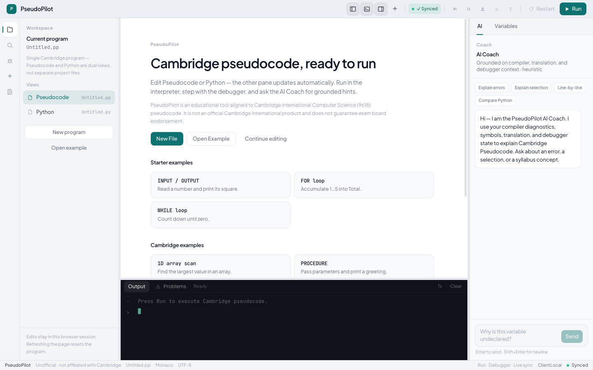
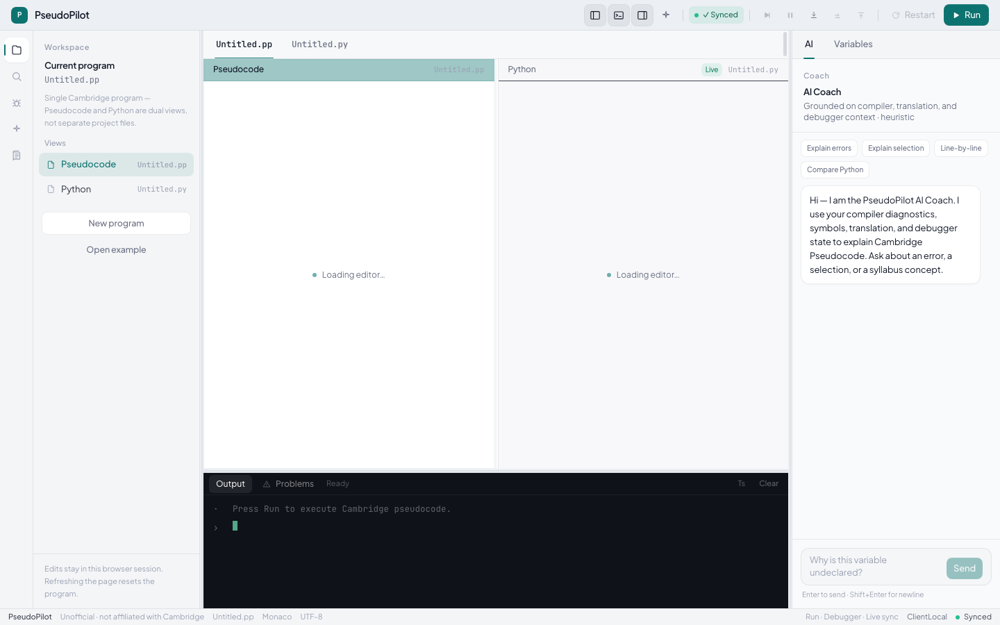
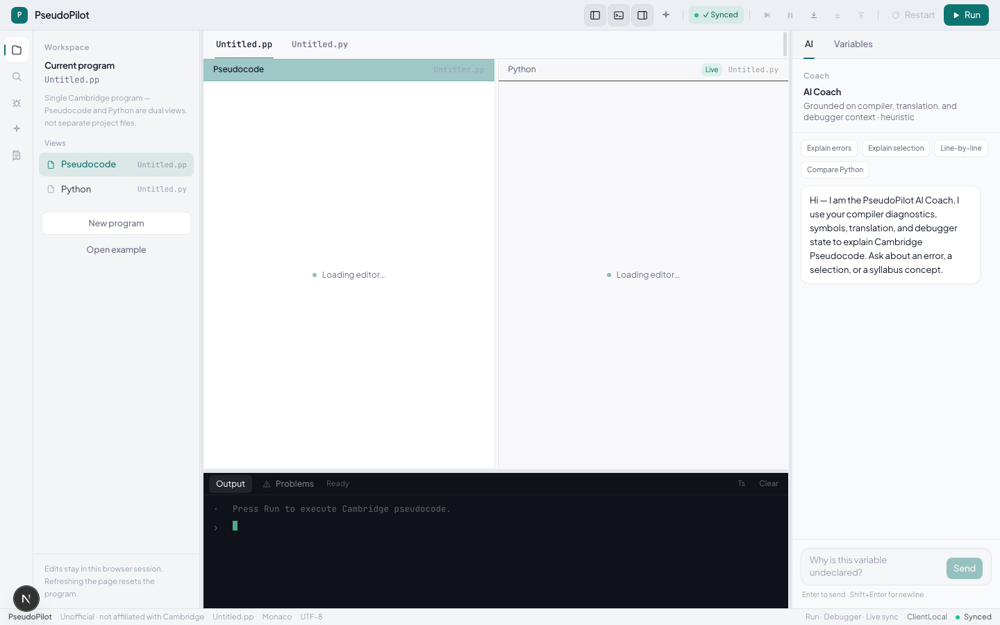
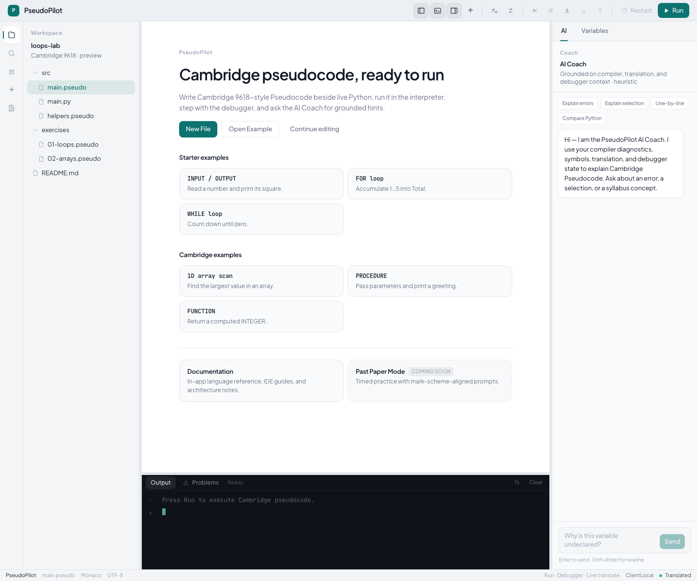
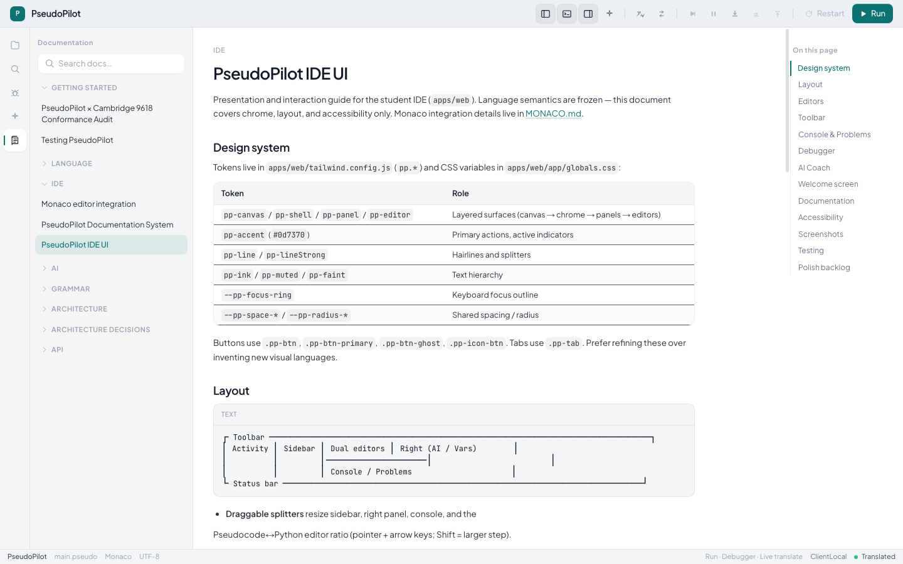

# PseudoPilot

**Cambridge International Computer Science (9618) pseudocode ↔ Python** student IDE and language toolchain.

Edit Pseudocode or Python side-by-side with live bidirectional translation, run programs in a browser interpreter, step with a debugger, and browse in-app docs. (AI Coach is implemented but **disabled in the v1.0.0-beta UI** — reserved for a future update.)

> **Version:** `1.0.0-beta.0` — public beta. APIs and packaging may still change before a stable `1.0.0`.
>
> **Affiliation:** PseudoPilot is an **educational** community project aligned to Cambridge 9618 pseudocode. It is **not** an official Cambridge International product, and it does **not** guarantee exam board endorsement. PseudoPilot is **not** affiliated with, endorsed by, or connected to Cambridge Assessment International Education or the University of Cambridge.

**License:** [MIT](./LICENSE) · **Security:** [SECURITY.md](./SECURITY.md) · **Contributing:** [CONTRIBUTING.md](./CONTRIBUTING.md) · **Changelog:** [CHANGELOG.md](./CHANGELOG.md)

---

## Features

| Feature | Description |
| --- | --- |
| Dual editors | Monaco Pseudocode + Python panes with live sync |
| Run | AST interpreter in a **Web Worker** (not Python execution) |
| Debugger | Breakpoints, continue / pause, step into / over / out, call stack, variables |
| Language service | Hover, go-to-definition, references, rename, completion, signatures |
| Diagnostics | Compiler (`C_*`), translation (`T_*`), and runtime (`R_*`) feedback |
| In-app docs | Searchable corpus of language and IDE guides |
| AI Coach | Implemented offline/rules-based coach — **UI disabled for v1.0.0-beta** (future update) |
| Virtual files | Text (and random) file I/O via an in-tab VFS — not OS disk |

---

## Screenshots

| Welcome | Editors | Console |
| --- | --- | --- |
|  |  |  |

| Docs welcome | Docs viewer |
| --- | --- |
|  |  |

More UI notes: [`docs/ide/UI.md`](./docs/ide/UI.md).

---

## Installation

**Requirements:** Node.js **22+** and pnpm **9+** (see `.nvmrc`).

```bash
corepack enable && corepack prepare pnpm@9.15.0 --activate
git clone https://github.com/jibrilapp/PseudoPilot.git   # or your fork URL
cd pseudopilot
pnpm install
```

No Postgres, Redis, or Docker is required to run the student IDE.

---

## Running locally

```bash
pnpm check   # optional: typecheck, lint, and unit tests

pnpm --filter @pseudopilot/web dev
```

Open [http://127.0.0.1:3000](http://127.0.0.1:3000). Turbo builds workspace dependencies as needed.

Add `?welcome=1` to force the welcome screen.

### Library usage (workspace)

Packages are `private: true` for now (consume via the monorepo workspace). Public npm publish is deferred until a stable release.

```ts
import { translatePseudocodeToPython } from '@pseudopilot/translator';
import { runPseudocode, MemoryHost } from '@pseudopilot/interpreter';

const py = translatePseudocodeToPython(`OUTPUT 1 + 1`);

const host = new MemoryHost();
const run = runPseudocode(`OUTPUT 1 + 1`, { host });
```

---

## Supported Cambridge features

PseudoPilot targets the *Cambridge International AS & A Level Computer Science 9618 — Pseudocode Guide for Teachers*.

**Authoritative status:** [`docs/CONFORMANCE.md`](./docs/CONFORMANCE.md) (compatibility matrix). Language specification and implementation notes live under [`docs/language/`](./docs/language/), including:

- [`SPECIFICATION.md`](./docs/language/SPECIFICATION.md)
- [`SEMANTICS.md`](./docs/language/SEMANTICS.md)
- [`TRANSLATION.md`](./docs/language/TRANSLATION.md)
- [`INTERPRETER.md`](./docs/language/INTERPRETER.md)
- [`FILE_IO.md`](./docs/language/FILE_IO.md)

Do not treat marketing copy as a substitute for CONFORMANCE. Reverse translation (Python → Pseudocode) is best-effort; Run always executes the Pseudocode buffer.

---

## Project structure

```
apps/web/                 Student IDE (Next.js)
packages/
  language-core/          Lexer, parser, AST
  checker/                Semantic analysis
  compiler-service/       Incremental compilation caches
  language-service/       IDE language features
  interpreter/            AST interpreter + VFS
  translator/             Bidirectional Pseudocode ↔ Python (canonical IR)
  conformance/            Cross-package Cambridge corpus
  ai-coach/               Offline coaching providers
docs/                     Language, IDE, architecture, release docs
```

**Boundary rule:** language packages must not import from `apps/*`. The IDE must not call the interpreter on the UI thread — use `RuntimeController` / the Web Worker.

Release packaging checklist: [`docs/RELEASE_READINESS.md`](./docs/RELEASE_READINESS.md).  
Deploy / hosting: [`docs/DEPLOY.md`](./docs/DEPLOY.md).

---

## Scripts

| Command | Purpose |
| --- | --- |
| `pnpm check` | Typecheck, lint, and unit tests |
| `pnpm build` | Build packages/apps that define `build` |
| `pnpm test` | Unit tests |
| `pnpm format` | Prettier write |

CI runs `pnpm check` plus a production `@pseudopilot/web` build on PRs to `main` (see `.github/workflows/ci.yml`). Deploy runbook: [`docs/DEPLOY.md`](./docs/DEPLOY.md).

---

## Versioning

- Product / workspace release line: **`1.0.0-beta.0`**
- Until a stable **1.0.0**, treat APIs as pre-release (breaking changes may still land)
- See [CHANGELOG.md](./CHANGELOG.md)

---

## Contributing

See [CONTRIBUTING.md](./CONTRIBUTING.md). Prefer focused PRs, extend tests with behaviour changes, and keep Cambridge fidelity documented in `docs/language/` / `docs/CONFORMANCE.md`.

---

## License

[MIT](./LICENSE) — Copyright (c) 2024–2026 PseudoPilot contributors.
